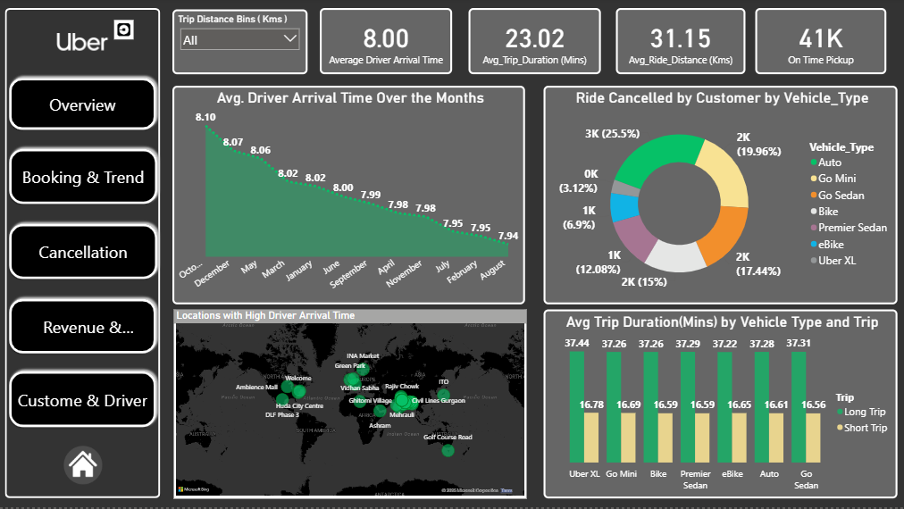
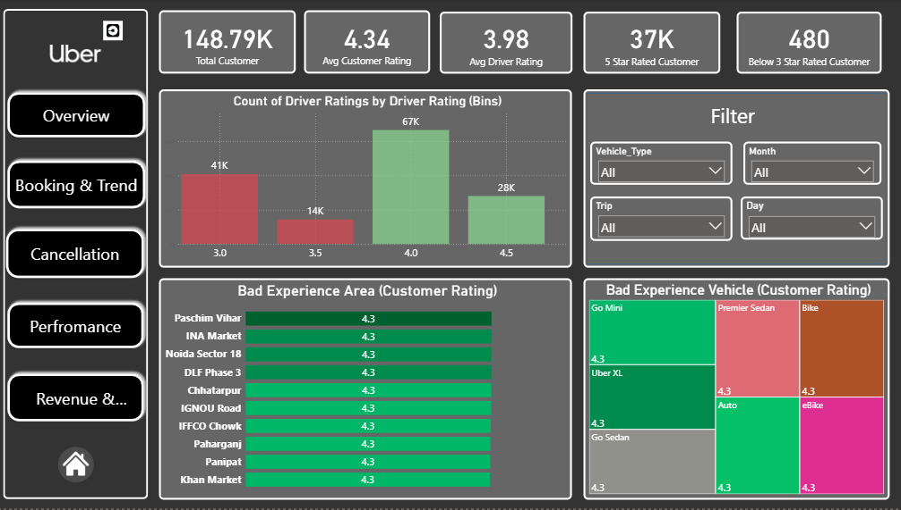

🔗 Uber Ride Analysis Dashboard using SQL & Power BI

🔗 Project Overview

This project provides a comprehensive analysis of Uber ride data for the NCR region using Power BI. The analysis covers key business metrics, trends, and insights including bookings, cancellations, performance, revenue, and customer/driver ratings. The goal is to help Uber or ride-hailing stakeholders make data-driven decisions by identifying trends, peak times, common cancellation reasons, revenue patterns, and service performance.

🔗 Pages & Features

1. Overview Page

Key Features:

KPIs

Total Sales: 64.17M

Total Rides: 93k

Avg Ride Distance: 31.15 km

Total Customers: 148.79k

Avg Trip Duration: 23.02 mins

Visualizations:

Line chart: Rides over months (peak in January,March,July)

Map: Most common pickup locations

Donut chart: Rides by vehicle type (Auto: 23.2k, Go Mini: 18.6k)

Bar chart: Most commonly used payment method (UPI: 42k, Uber Wallet: 24k)

2. Bookings & Trends Page

Key Features:

KPIs:

Completed Rides: 93k

Pending Rides: ~ 8994

Visualizations:

Column chart: Bookings by month, weekdays vs weekends (avg 9.5k weekday rides, 3.5k weekend)

Bar chart: Booking status (Completed: 93k, Cancelled by Driver: 27k, Cancelled by Customer: 11k)

Histogram: Bookings by ride distance (highest between 10-40 km)

Donut chart: Booking by vehicle type

3. Cancellation Page

Key Features:

KPIs:
Total Cancelled Rides: 38k

Cancelled by Customers: 11k

Cancelled by Drivers: 27k

Total Incomplete Rides: ~8994

Visualizations:

Table: Booking status, cancellation reasons, and count

Column chart: Rides cancelled by day (avg 4.1 k driver cancellations, 1.5 k customer cancellations)

Line chart: Cancellations over months by driver and customer

Donut chart: Cancellations by vehicle type (Auto & Mini dominate)

4. Performance Page

Key Features:

KPIs:

Avg Driver Arrival Time: 8.0 mins

Avg Trip Duration: 23.02 mins

Avg Ride Distance: 31.15 km

On-time Pickups: 41k

Visualizations:

Line chart: Avg arrival time by month (Oct & Dec highest)

Donut chart: Rides cancelled by vehicle type

Map: Locations with high arrival times

Column chart: Avg trip duration by vehicle type

5. Revenue & Payment Page

Key Features:

KPIs:

Total Revenue: 61.17M

Most used Payment Method: UPI

Day generating most revenue: Sunday

Visualizations:

Line chart: Revenue over months (March: 5.36M, Jan: 5.46M)

Donut chart: Revenue by payment method

Funnel chart: Revenue by hour (6 PM highest)

Bar chart: Revenue by vehicle type

6. Customer & Driver Ratings Page

Key Features:
KPIs:

Total Customers: 148.79k

Avg Customer Rating: 4.34

Avg Driver Rating: 3.98

Total Rides with 5-star: 37k

Visualizations:

Histogram: Customer ratings distribution (majority 4-3)

Line chart: Ratings over months

Tree map: Ratings by vehicle type

🧰 Tools & Technologies Used

. Power BI Desktop: For data modeling, data transformation, and creating interactive dashboards.

. DAX (Data Analysis Expressions): Used to build calculated columns, measures, and KPIs for performance analysis.

. MySQL: Used for data extraction and advanced SQL queries to analyze ride data before visualization.

. Microsoft Excel: Used for initial data creation, cleaning, and minor transformations.

. Kaggle Dataset: Provided raw Uber ride data (~1.5 lakh rows) for analysis.

. PowerPoint: Used for project presentation and summarizing dashboard insights.

. GitHub: For hosting project files, screenshots, and documentation.

🔗 Conclusion

This dashboard provides actionable insights for Uber operations, helping identify peak hours, most profitable days, common cancellation reasons, customer/driver satisfaction trends, and areas for operational improvement. It serves as a decision-support tool for ride-hailing business analytics.
